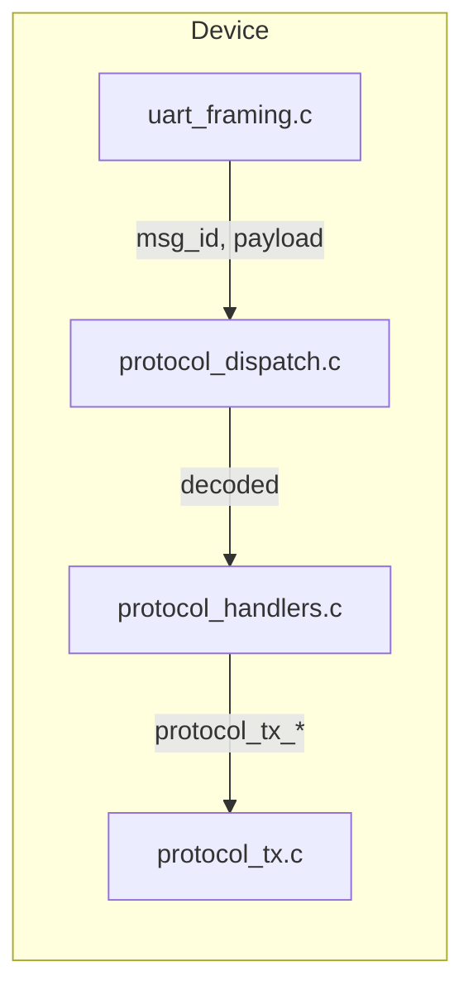

# UART CLI to Protobuf Port

## Locked-in decisions

- **Logging:** One message per log event (e.g. `ImuInvalidChipIdEvent { imu_index; chip_id }`). Typed, self-documenting. ~50+ event types; codegen handles them. **Omit log level from the wire:** do not add a severity/level field to each log-event message. The message type already implies severity (e.g. InvalidChipId = warning, TargetListFull = error). Saves ~1 byte per message and keeps payloads smaller. Host defines severity per message type (e.g. table or .proto comments) for display and filtering.
- **Host enums:** Add `protoc --python_out` to codegen; host uses generated `*_pb2.py` for enums (Option A).
- **Logging path:** Call sites call `protocol_tx_`* directly (e.g. `protocol_tx_ImuInvalidChipIdEvent(&msg)`) from **task context** only. Optional thin helpers that fill the struct and call `protocol_tx_`* keep proto knowledge in one place. Single UART TX queue ([drivers/uart_driver/uart_driver.c](drivers/uart_driver/uart_driver.c)) handles both responses and log events. **error_handler:** Remove entirely; no history/counters.
- **Fire-and-forget:** Generic `AckResponse { bool success; uint32 error_code }` for UwbStart, UwbStop, ErrorClear, StopwatchStart, etc.
- **Handlers:** Single file first — extend [src/uart_protocol/protocol_handlers.c](src/uart_protocol/protocol_handlers.c) until ~500+ lines, then split by domain.
- **Scope:** Full port in one go (all domains and all log-event types; no batching).
- **Error history on device:** Completely remove all error history funciotnality
- Completely remove error_handler.c/.h in the application code

## Current architecture

- **Framing:** [src/uart_protocol/uart_framing.c](src/uart_protocol/uart_framing.c) decodes COBS+CRC and calls `protocol_dispatch(msg_id, payload, len)`.
- **Dispatch:** [generated/protocol/protocol_dispatch.c](generated/protocol/protocol_dispatch.c) (codegen) decodes protobuf and invokes weak `protocol_rx_<MessageName>(&decoded)`.
- **Handlers:** [src/uart_protocol/protocol_handlers.c](src/uart_protocol/protocol_handlers.c) implements Ping, GetConfig, SetAddress; each calls existing APIs and sends response via `protocol_tx_<Response>(&r)`.
- **Proto:** [protocol/uart_protocol.proto](protocol/uart_protocol.proto) defines messages; message order sets `msg_id`. Codegen: [protocol/codegen_protocol.py](protocol/codegen_protocol.py). Re-run after any .proto change.

**Constraint:** `PROTOCOL_MAX_PAYLOAD` = 110 bytes; `PROTOCOL_TX_BUF_SIZE` = 80. Increase TX buffer to 110 and keep all encoded messages within 110 bytes.

## Proto changes ([protocol/uart_protocol.proto](protocol/uart_protocol.proto))

- **Enums:** NodeType (tag/anchor/hybrid), and any state enums. Define in .proto; nanopb gives C enums; `protoc --python_out` gives host enums. No LogLevel enum on the wire; host assigns severity per log-event message type for display/filtering.
- **Request/Response by domain:** System (GetUuid, GetInfo), Beacon (Ping), IMU (GetStatus, GetData, StreamStart/Stop + **ImuStreamPayload**), UWB node (Set/Get Type, Position, Address, Status), UWB (GetStatus, GetStats, Start, Stop, ResetStats with AckResponse), Error (GetStatus, Clear), Datalogger (GetTasks, GetStats), TWR (GetStatus, GetResult, RangeRequest), TWR manager (Start/Stop, GetStatus, Add/Remove/Set/Clear targets, Set/Get ranging rate), Stopwatch (Get, Start, Stop), OTA config (SendAddress/Position/Type/Gpio, Set/Get token, GetStats), Sensor fusion (Get/Set Debug, Status, Active, ImuEnabled, Noise, Config).
- **Log events:** One message per event (~50+), e.g. `ImuInvalidChipIdEvent { uint32 imu_index = 1; uint32 chip_id = 2; }`. No level/severity field on the wire; host maps message type → severity for display/filtering. No generic event_id + param0..3.
- **Common:** `AckResponse { bool success = 1; uint32 error_code = 2; }`. Use nanopb options (`max_length`, `max_count`) for repeated/strings.

## Codegen and buffers

- **Pipeline:** (1) nanopb: `python protocol/run_nanopb_gen.py` → uart_protocol.pb.c/h. (2) Project codegen: `python protocol/codegen_protocol.py` → protocol_ids.h, protocol_dispatch.c/h, protocol_tx.c/h, protocol_ids.py in generated/protocol/. (3) Add: `protoc --python_out=generated/protocol -I protocol protocol/uart_protocol.proto` → uart_protocol_pb2.py. Add step (3) to make/protocol-codegen or verify_codegen.
- In [protocol/codegen_protocol.py](protocol/codegen_protocol.py), set `PROTOCOL_TX_BUF_SIZE` to 110. Run [protocol/verify_codegen.py](protocol/verify_codegen.py).

## Handler implementation ([src/uart_protocol/protocol_handlers.c](src/uart_protocol/protocol_handlers.c))

- Implement `protocol_rx`_* for every new Request. Call same APIs the old router used; fill Response and call `protocol_tx_<Response>(&r)`. Fire-and-forget → send **AckResponse**.
- **IMU streaming:** On ImuStreamStartRequest (mode array/avg), start a stream task that at 10 Hz reads IMU and sends **ImuStreamPayload**; on ImuStreamStopRequest, stop.
- **Beacon:** In `protocol_rx_BeaconPingRequest`, build DATA beacon header, call `uwb_send_message`, send BeaconPingResponse(success).
- Dependencies: imu.h, uwb_node.h, uwb.h, datalogger.h, initiator.h, responder.h, twr_manager.h, twr_scheduler.h, stopwatch.h, ota_config.h, system_driver.h, sensor_fusion.h, DATA protocol header, uwb_send_message. No error_handler if removed.

## Logging: direct protocol_tx_*

- **Single path:** Call sites call `protocol_tx`_* directly from **task context**, or use optional thin helpers that fill the message and call the same. All traffic (responses + log events) goes through the existing UART TX queue in [drivers/uart_driver/uart_driver.c](drivers/uart_driver/uart_driver.c) (depth 8).
- **Constraint:** Only call `protocol_tx`_* from task context — `uart_driver_transmit` uses `xQueueSend(..., portMAX_DELAY)`, so ISR must not call it. If ISR logging is needed later, add a minimal lock-free path then. Delete all logging in ISRs. 
- **error_handler:** Remove entirely. No history/counters. For fatal: before halt, optionally send one log-event message via `protocol_tx`_* if in task context; then delay and halt.
- **Cleanup:** Remove all `uart_manager_print` and error_handler references.

## Retaining full error information (critical)

When replacing `error_handler_log` calls with dedicated protocol messages, **do not lose any significant information**. Each new message type must:

1. **Carry the explanation of the error** — The message name and fields should make it clear *what* went wrong (e.g. "init returned NULL", "invalid chip ID", "frame too small"), not just severity + raw numbers.
2. **Include all relevant data** — Every value that was in the original format string (indices, IDs, lengths, codes, addresses) must be a field in the proto message so the host can display or log the full context.

Do **not** replace a specific error with a generic "LogEvent(severity, param0, param1)" that loses the meaning. The message type itself is the explanation; the fields are the data. The host should be able to show a human-readable equivalent of the original log line.

**Examples from the codebase (each must be replaced by a dedicated message that preserves explanation + data):**

- **IMU** [src/imu/imu.c](src/imu/imu.c) ~256: `error_handler_log(..., "IMU %u: init returned NULL", idx)` → Message must convey *init returned NULL* and include `imu_index`. e.g. `ImuInitReturnedNullEvent { imu_index }`.
- **IMU** [src/imu/imu.c](src/imu/imu.c) ~272: `error_handler_log(..., "IMU %u: invalid chip ID 0x%02X", idx, chip_id)` → Message must convey *invalid chip ID* and include `imu_index`, `chip_id`. e.g. `ImuInvalidChipIdEvent { imu_index; chip_id }`.
- **OTA config** [src/ota_config/ota_config.c](src/ota_config/ota_config.c) ~163: `error_handler_log(..., "Unknown message type: 0x%02X", msg_type)` → Message must convey *unknown message type* and include `message_type`. e.g. `OtaConfigUnknownMessageTypeEvent { message_type }`.
- **UWB** [src/uwb/uwb.c](src/uwb/uwb.c) ~386: `error_handler_log(..., "Frame too small: %u bytes", length)` → Message must convey *frame too small* and include `length` (bytes). e.g. `UwbFrameTooSmallEvent { length }`.
- **UWB node** [src/uwb_node/uwb_node.c](src/uwb_node/uwb_node.c) ~76: `error_handler_log(..., "Invalid node type: %d", type)` → Message must convey *invalid node type* and include `node_type`. e.g. `UwbNodeInvalidTypeEvent { node_type }`.
- **TWR responder** [src/twr/responder.c](src/twr/responder.c) ~167: `error_handler_log(..., "Failed to send message type %d", msg_type)` → Message must convey *failed to send message* and include `message_type`. e.g. `ResponderFailedToSendMessageEvent { message_type }`.
- **TWR scheduler** [src/twr_manager/twr_scheduler.c](src/twr_manager/twr_scheduler.c) ~148: `error_handler_log(..., "Target list full")` → Message must convey *target list full*; no extra data needed. e.g. `TwrSchedulerTargetListFullEvent {}`.

Apply the same rule everywhere: one dedicated message per distinct error or log line; message name and fields together retain the full explanation and data. No generic event_id + param0..3.

## Host tool ([tools/host/serial/uart_protocol_tool.py](tools/host/serial/uart_protocol_tool.py))

- Map each old CLI command to proto: send Request, parse Response/AckResponse and log-event messages. Use generated `*_pb2.py` for decode; optional message-type → format-string table for human display. Document command set (help or README).

## Cleanup

- Remove references to old CLI and uart_manager. Remove error_handler (already covered in logging section).

